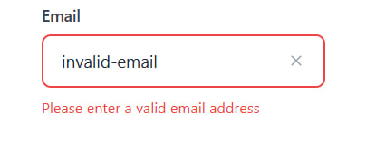
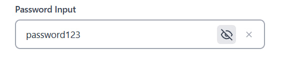
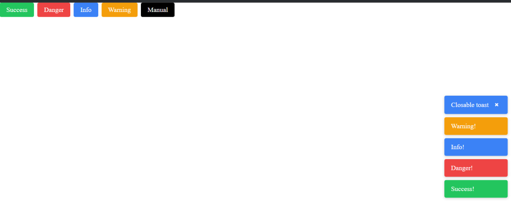
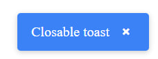
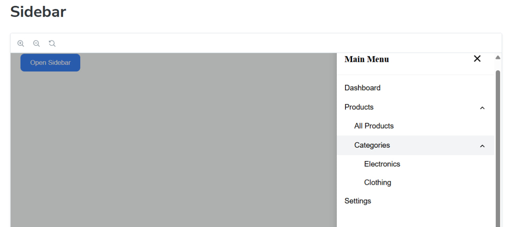
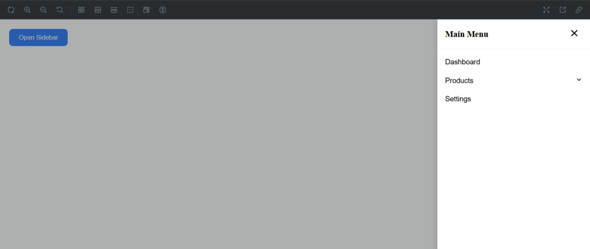

 # React Component Library

Це Storybook-базована бібліотека UI-компонентів для React.

## Запуск
Встановити залежності:bash
npm install
npm run storybook
Відкрити у браузері:
http://localhost:6006

# Компоненти

## 1. Input

Типи: text, password, number

- Можливість очищення (clearable)  
- Для пароля: іконка toggle видимості

**Скріншоти:**

- **Input error**  

- **Password input (toggle visibility)**  

---

## 2. Toast

Типи: success, danger, info, warning

- Автовидалення через `duration`  
- Можливість закриття вручну (closable)

**Скріншоти:**

- **All Toasts**  

- **Closable toast**  

---

## 3. Sidebar Menu

- Open / Closed стани  
- Підменю 1 рівня і 2 рівня  
- Закривається при кліку на бекграунд

**Скріншоти:**

- **Sidebar opened nested**  

- **Sidebar opened 1lvl**  

 
